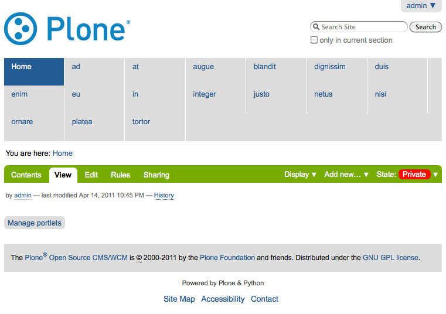

Introduction
============

This demo is:

* Proof of concept for mr.migrator: A tool that provides the ability to
  register and execute collective.transmogrifier pipelines without creating a
  Python package. It's Miller Time™.

* Also proof of concept for collective.transmogrifier with the CMFCore
  dependency removed (and a zope.component dependency added in its place).
  It's Scotch time™.

Explanation
-----------

In order to work, it currently relies on:

* https://svn.plone.org/svn/collective/collective.transmogrifier/branches/aclark-mr-migrator-compat
* https://svn.plone.org/svn/collective/transmogrify.filesystem/branches/aclark-mr-migrator-compat
* git@github.com:aclark4life/transmogrify.ploneremote.git 

These are, respectively:

* A branch of c.transmogrifier with a setuptools entry point plugin system
  added, and the CMFCore dependencies removed (gracefully, I hope).

* A branch of t.filesystem with the collective.transmogrifier entry point
  specified (and some CMFCore dependencies removed).

* A fork of t.ploneremote with the collective.transmogrifier entry point
  specified (and some CMFCore dependencies remove).

Installation
------------

You can try out this demo::

    $ git clone git@github.com:aclark4life/mr_migrator_demo.git
    $ cd mr_migrator_demo
    $ python bootstrap.py
    $ bin/buildout

Elsewhere, setup a Plone site listenining on localhost:8080 with a Plone site
object called "Plone" and then:

    $ bin/mr.migrator

You should end up with content in Plone that looks like this:

